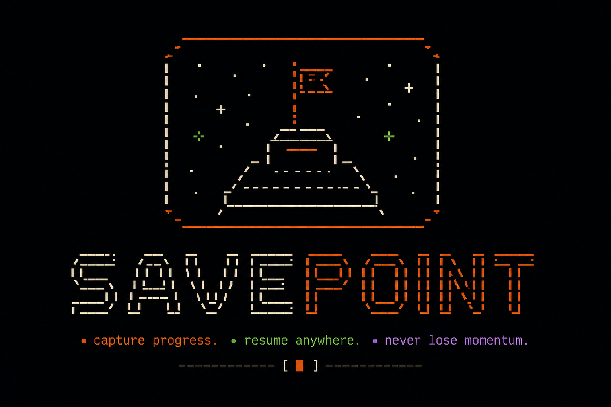

# 💾 SAVEPOINT

> **Hard Gates. Zero Drift. All Vibe.**

Built for **vibe coders** on tight token budgets who still want to ship.

```bash
npx savepoint init
```

I love building side projects with AI. It feels like magic. But the reality of "vibe coding" is that it usually falls apart on day three. Not because the model is bad, but because there are no boundaries.

AI-driven development fails for three specific reasons:

1. **The Drift:** Your `Design.md` and agent instructions go stale after the first iteration; nobody updates them.
2. **Token Bloat:** Monolithic backlogs and MCP overhead burn your context window — and your budget.
3. **The Chaos:** No repeatable process from a "vibe" to a working MVP.

**Savepoint is a baby gate for AI agents.**

It’s a simple, file-based state machine and cinematic Terminal UI (TUI) designed to force you—and your agent (Claude, Cursor, Aider, Gemini)—to slow down, write down what you're actually building, and check your work before moving on.

No database. No proprietary cloud. **No telemetry, ever.** Your filesystem is the map, and Savepoint keeps the agent on it.

---

## 🔄 The Loop (Driven by Agent Skills)

Savepoint turns your project into a series of hard gates, enforced by **six bundled custom agent skills** (`draft-prd`, `system-design`, `create-plan`, `create-task`, `build-task`, `audit`). You cannot move forward until the current gate is cleared.

`[ PRD ]` **→** `[ DESIGN ]` **→** `[ EPICS ]` **→** `[ TASKS ]` **→** `[ BUILD ]` **→** `[ AUDIT ]`

Small scopes. Small context windows. No wandering.

- **The PRD Gate (`draft-prd`):** The agent interviews you to ensure your idea is crisp enough for a V1 before writing any architecture.
- **The Design Gate (`system-design`):** Write down what you actually want. If you can't explain it simply in a markdown file, the AI is going to make a mess of it.
- **The Plan Gate (`create-plan` & `create-task`):** Break the idea down into small, manageable steps. No giant leaps. This becomes the checklist the AI _must_ follow.
- **The Build Gate (`build-task`):** The AI writes code for one small step at a time. The scope stays tight so it doesn't wander off into the weeds. It logs "Drift Notes" instead of cowboy-coding architectural changes.
- **The Audit Gate (`audit`):** Before moving on, we stop and check. Does the code match the plan? We don't advance until the map matches the territory.

> 🔒 **The Audit Loop** — When the last task in an epic moves to `done`, the next epic stays _locked_ until your docs (`Design.md`, `AGENTS.md`, and the epic's own design) are reconciled with the actual code via the audit agent. **No existing markdown-first task tool has this gate.**

---

## 🛠 The Stack (Atari-Noir)

Built for a cinematic, technical feel without the bloat.

- **Cinematic TUI:** Built with Go and Bubble Tea. It feels like a proper terminal tool, lightning-fast and dependency-free.
- **File-First:** Your project's state lives in markdown and JSON files right next to your code.
- **Agent-Agnostic:** Claude, Cursor, Aider, Gemini — if it reads markdown and edits files, it works. No MCP server. No per-agent adapters.
- **Token-Efficient by Design:** Tasks read <2KB of context. Audits stay under ~15KB. No more burning your AI budget on bloated backlogs.

---

## 💻 Commands (0.1.0-MVP)

| Command            | Action                                                                                               |
| :----------------- | :--------------------------------------------------------------------------------------------------- |
| `savepoint init`   | Scaffold the loop, write your `AGENTS.md` guide, drop the baby gates, and generate the magic prompt. |
| `savepoint board`  | Launch the Atari-Noir Kanban TUI to track the vibe.                                                  |
| `savepoint audit`  | Stop the AI. Sync the map with the territory.                                                        |
| `savepoint doctor` | Check the integrity of the state machine.                                                            |

---

## 🪞 Recursive Construction

I am building Savepoint to dogfood the very workflow it enables. **This entire repository is being built by agents, guided by Savepoint’s own state machine.**

I’m sharing it to prove a point: The real power of AI isn't just the size of the LLM—it’s the structure you give it. Token-efficient, documentation-first development is the only way to build at scale with AI without losing your mind.

**The goal:** Go from `npx savepoint init` to a merged epic in one weekend.

**License:** MIT  
**Status:** Recursive Construction (v1 MVP in progress)
