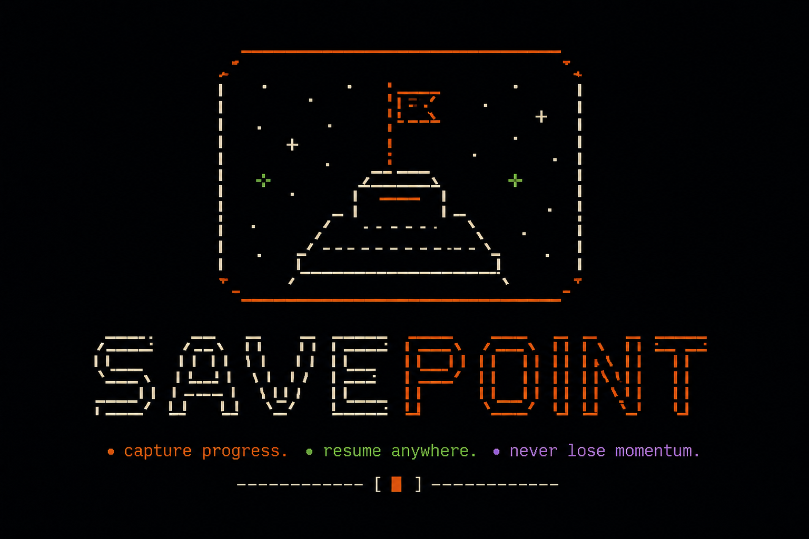

# Savepoint

> Hard gates for AI-driven development. Local files, tight context, no telemetry.

Savepoint is a local-first CLI and Bubble Tea terminal board for keeping AI-assisted projects inside a documented workflow. It gives any coding agent a small set of markdown files to read, a router state to follow, and explicit handoff points before work drifts away from the plan.

It is built for vibe coders who want agents to do real implementation work without turning the project into an unbounded chat history.

No database. No proprietary cloud. No telemetry. Your filesystem is the source of truth.

## Quick Start

```bash
npx savepoint init
npx savepoint board
npx savepoint doctor
```

`init` scaffolds the Savepoint workflow into the current directory. `board` opens the TUI. `doctor` checks that the project state is still coherent.

After `init`, point your agent at `AGENTS.md` and let it follow the router.

## What Savepoint Creates

Savepoint stores project state in markdown and YAML frontmatter next to your code:

```text
.savepoint/
  PRD.md
  Design.md
  router.md
  releases/
    v1/
      v1-PRD.md
      epics/
        E01-example/
          E01-Detail.md
          tasks/
            T001-example.md
      defects/
        D001-example.md
AGENTS.md
agent-skills/
```

The important bit is the hierarchy:

`Product Vision -> Release PRD -> Epic Detail -> Task -> Build/Test/Audit -> Handoff`

Agents read the smallest useful file set at each step instead of loading an entire backlog into context.

## The Workflow

Savepoint turns AI development into a sequence of hard gates:

| Gate | What happens |
| --- | --- |
| PRD | Define the product, target user, constraints, and success metrics. |
| Design | Write the architecture and codebase map before implementation starts. |
| Epic | Define a focused slice of the release. |
| Task | Break the epic into small, dependency-aware build steps. |
| Build | Implement one task at a time using only its scoped context files. |
| Audit | Reconcile code, design docs, agent guidance, and drift notes before moving on. |

The audit gate is the differentiator. When an epic finishes, the next epic should not start until the built code and the project map agree again.

## Task Lifecycle

Tasks use a small lifecycle:

```yaml
status: planned       # planned | in_progress | done
stage: build          # required only when status: in_progress
```

Valid in-progress stages are:

- `build`
- `test`
- `audit`

Agents may move a task to `in_progress` when they start work. The user owns closing a task as `done` or retreating it to an earlier status.

## Board

`savepoint board` opens the Atari-Noir terminal UI:

- Three task columns: `planned`, `in_progress`, and `done`
- Build/test/audit stage visibility for active work
- Next Activity line driven by `.savepoint/router.md`
- Epic sidebar and epic detail overlay for release navigation
- `p` priority hotkey to set the router to the focused task
- `d` defect overlay for release-level bugs
- `A` read-only audit register overlay with finding detail
- Non-TTY fallback for plain terminal output

You can scope the board when needed:

```bash
savepoint board --release v1.2
savepoint board --epic E20-clean-up-lifecycle
```

Running `savepoint` with no arguments also opens the board.

## Defect Workflow

Use defects for concrete bugs, regressions, broken expectations, or failed behavior that should be repaired without reshaping the planned epic backlog.

Defects live at:

```text
.savepoint/releases/{release}/defects/D###-slug.md
```

Example frontmatter:

```yaml
---
id: v1.2/D001-router-priority
release: v1.2
status: open          # open | in_progress | resolved
severity: high        # critical | high | medium | low
title: "Router priority is not preserved after board navigation"
introduced: v1.2.0
reference: E20-clean-up-lifecycle/T003-router-handoff
---
```

When a defect is actively being repaired, it also carries a stage:

```yaml
status: in_progress
stage: build          # build | test | audit
```

Defects are release-level workflow items. They are surfaced through the board defect overlay and doctor validation, not as a fourth Kanban column.

## Audit Register

The Audit Register is a durable, repo-wide record of audit findings, so repeated audits converge on one shared state instead of restarting from a cold scan every run.

It lives in markdown under `.savepoint/audit/`:

```text
.savepoint/audit/
  prompt.md        # canonical, versioned audit prompt
  register.md      # current reconciled state (mutable index)
  findings/        # one file per finding: F###-slug.md
  runs/            # immutable audit run history: YYYY-MM-DD-label.md
```

How it works:

- Every finding gets a stable `F###` ID that never changes and is never reused. An audit that sees a known finding again keeps its ID and refreshes `last_seen` instead of filing a duplicate.
- Each audit run is recorded as an immutable file under `runs/`, including what was examined and what was skipped. The register is the current state derived from that history.
- A finding closes as `verified` only with named proof — preferably a passing regression test, otherwise an explicit manual verification note. Waivers and owner decisions stay with you, not the agent.

To use it, ask your agent to audit and point it at `AGENTS.md` — the generated guidance routes audit work through `.savepoint/audit/prompt.md` and the `savepoint-audit-register` skill.

Press `A` on the board to review the register, findings, and run history in a read-only overlay. In v1.4 the markdown files remain the editable source of truth: dispositions and edits happen in the files, not the TUI. There are no dashboards, external tracker integrations, or automated finding matching — reconciliation is deliberate, manual work.

## Agent Skills

Savepoint ships workflow skills that act as the canonical instructions for each phase:

- `savepoint-draft-prd`
- `savepoint-system-design`
- `savepoint-create-plan`
- `savepoint-create-task`
- `savepoint-build-task`
- `savepoint-audit`
- `savepoint-audit-register`
- `savepoint-create-defect`

`AGENTS.md` routes the agent to the right skill based on `.savepoint/router.md`. The skill owns the phase workflow; `AGENTS.md` keeps routing, terminology, and repository rules in one place.

This repository also includes `bubbletea-tui-design` for maintaining the Go TUI in `internal/board` and `internal/styles`.

## CLI Reference

| Command | Action |
| --- | --- |
| `savepoint` | Launch the board for the current Savepoint project. |
| `savepoint --version` | Print the installed version. |
| `savepoint init [dir] [--force] [--install]` | Scaffold `.savepoint/`, `AGENTS.md`, agent skills, templates, and the magic prompt. |
| `savepoint board [--release <release>] [--epic <epic>]` | Open the TUI, optionally scoped to a release or epic. |
| `savepoint doctor [--epic <epic>]` | Validate project structure, router state, task lifecycle metadata, defects, and references. |
| `savepoint upgrade-assets [dir] [--dry-run] [--force]` | Refresh package-owned templates and skills in an existing project. |

`savepoint doctor` exits with `0` when clean, `1` when it finds project problems, and `2` for internal errors or invalid command usage.

## Updating Existing Projects

After updating the Savepoint package, refresh package-owned assets in each existing Savepoint project:

```bash
savepoint upgrade-assets --dry-run
savepoint upgrade-assets
```

`upgrade-assets` refreshes bundled `agent-skills/**/SKILL.md` files and the Savepoint-managed block in `AGENTS.md`. It does not overwrite `.savepoint/PRD.md`, `.savepoint/Design.md`, release PRDs, epic files, task files, audit files, or defect files.

Use `--force` only when you intentionally want to replace locally modified package-owned assets.

## Design Principles

- File-first: markdown and YAML are the project database.
- Agent-agnostic: any agent that can read files and edit files can follow the workflow.
- Token-efficient: tasks point agents to scoped context files instead of whole-project dumps.
- Audit-driven: documentation drift is treated as a workflow failure, not a cleanup chore.
- Local-only: no telemetry, cloud sync, or proprietary service dependency.
- Small diffs: work is broken into reviewable epics and tasks.

## Development

Build and test from source:

```bash
make build
make test
```

The CLI is written in Go. The board uses Bubble Tea. The npm package wraps the compiled binary so users can run Savepoint with `npx` or a global install.

## Status

Savepoint is under recursive construction: this repository is being built with Savepoint's own workflow.

Current focus is the v1.2 line:

- First-class release defects in the TUI and doctor checks
- Simpler template and skill guidance
- Task complexity metadata
- Centralized lifecycle parsing, validation, and transition rules

License: MIT
